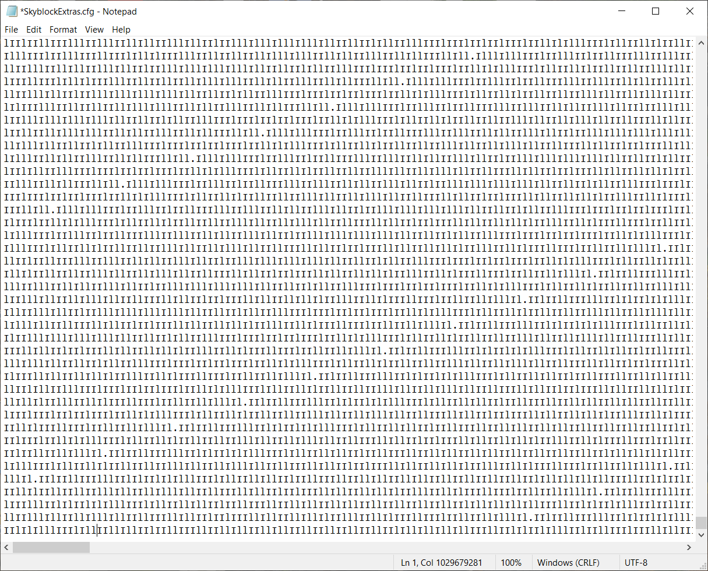

# Mod-Alternatives
## Provides alternatives for many popular but bad clients, mods or mod folders.

    
Badlion Client

# Replacements.
- 1.7 Animations
    - [Sk1er's Old Animations (BETA)](https://sk1er.club/beta)
    - [SpiderFroggy's Old Animations](https://oldanimationsmod.net) (Not recommended, but it works perfectly fine.)
- Armour/Armor Status
    - [Powns' ArmorHUD](https://download.powns.dev/armorhud189)
    - [Sk1er's ChromaHUD](https://sk1er.club/mods/ChromaHUD)
    - [Xander's EvergreenHUD](https://github.com/Evergreen-Client/EvergreenHUD/releases/latest)
    - [MatthewTGM's SimpleHUD](https://www.curseforge.com/minecraft/mc-mods/simplehud)
    - [MatthewTGM's Terbium (BETA)](https://discord.gg/teZMYPwW5x)
- AutoGG
    - [Sk1er's AutoGG](https://sk1er.club/mods/autogg)
- AutoText
    - [MattOnMC's MacroKeyBinding](https://www.curseforge.com/minecraft/mc-mods/macrokey-keybinding/files/2659839)
- AutoTip
    - [Semx11's AutoTip](https://autotip.pro/)
- BlockOverlay
    - [Aycy's BlockOverlay](https://hypixel.net/threads/forge-1-8-9-block-overlay-v4-0-3.1417995/)
    - [MatthewTGM's Terbium (BETA)](https://discord.gg/teZMYPwW5x)
- BossBar
    - [Sk1er's BossBar Customizer](https://sk1er.club/mods/bossbar_customizer)
    - [MatthewTGM's Terbium (BETA)](https://discord.gg/teZMYPwW5x)
- CPS Counter
    - [Sk1er's ChromaHUD](https://sk1er.club/mods/ChromaHUD)
    - [Xander's EvergreenHUD](https://github.com/Evergreen-Client/EvergreenHUD/releases/latest)
    - [MatthewTGM's SimpleHUD](https://www.curseforge.com/minecraft/mc-mods/simplehud)
    - [MatthewTGM's Terbium (BETA)](https://discord.gg/teZMYPwW5x)
- Clear Chat
    - [Sk1er's Patcher](https://sk1er.club/mods/patcher)
- Clan Wars
    - None
- Clear Water
    - [OptiFine](https://optifine.net/adloadx?f=preview_OptiFine_1.8.9_HD_U_M6_pre1.jar&x=a0d5)
- Combo Counter
    - [Erouax Combo Display](https://www.mediafire.com/file/ofrq5kgikbklb2a/Combo_Display_1.8.9.jar/file)
- Coordinates
    - [Sk1er's ChromaHUD](https://sk1er.club/mods/ChromaHUD)
    - [Xander's EvergreenHUD](https://github.com/Evergreen-Client/EvergreenHUD/releases/latest)
    - [MatthewTGM's SimpleHUD](https://www.curseforge.com/minecraft/mc-mods/simplehud)
    - [Batty's Coords PLUS](https://www.curseforge.com/minecraft/mc-mods/batty-ui/files/2272073)
    - [Powns' Coords HUD](https://download.powns.dev/coordsmod189)
    - [MatthewTGM's Terbium (BETA)](https://discord.gg/teZMYPwW5x)
- Crosshair Mod
    - [Sparless' Custom Crosshair](https://www.curseforge.com/minecraft/mc-mods/custom-crosshair-mod/files/3164058)
- DirectionHUD
    - [Sk1er's ChromaHUD](https://sk1er.club/mods/ChromaHUD)
    - [Xander's EvergreenHUD](https://github.com/Evergreen-Client/EvergreenHUD/releases/latest)
    - [MatthewTGM's Terbium (BETA)](https://discord.gg/teZMYPwW5x)
- Enchant Glint
    - [Powns' Glint Colourizer](https://download.powns.dev/glintcolorizer189)
    - [MatthewTGM's Terbium (BETA)](https://discord.gg/teZMYPwW5x)
- FOV Changer
    - [Sk1er's Patcher (/fov command)](https://sk1er.club/mods/patcher)
- FPS Counter
    - [Sk1er's ChromaHUD](https://sk1er.club/mods/ChromaHUD)
    - [Xander's EvergreenHUD](https://github.com/Evergreen-Client/EvergreenHUD/releases/latest)
    - [MatthewTGM's SimpleHUD](https://www.curseforge.com/minecraft/mc-mods/simplehud)
    - [Batty's Coords PLUS](https://www.curseforge.com/minecraft/mc-mods/batty-ui/files/2272073)
    - [Aycy's MiniInfo](https://www.youtube.com/watch?v=9OwPMxBzQog)
    - [Sk1er's Keystrokes](https://sk1er.club/mods/keystrokesmod)
    - [MatthewTGM's Terbium (BETA)](https://discord.gg/teZMYPwW5x)
    - [OptiFine](https://optifine.net/adloadx?f=preview_OptiFine_1.8.9_HD_U_M6_pre1.jar&x=a0d5)
- Fullbright
    - [Sk1er's Patcher](https://sk1er.club/mods/patcher)
- Ghost Liquid Fix
    - [Powns' Lava Fix](https://download.powns.dev/lavafix189)
    - [MatthewTGM's Terbium (BETA)](https://discord.gg/teZMYPwW5x)
- Hit Colour
    - [Aycy's Damage Tint](https://www.youtube.com/watch?v=ZK1C8iThJAA)
- Hitboxes
    - Vanilla (F3 + B)
- Inventory Blur
    - [tterrag's Blur](https://www.curseforge.com/minecraft/mc-mods/blur/files/2665186)
- In-game server switcher
    - [Canalex' InGameServerSwitcher](https://www.youtube.com/watch?v=04EangMQd7I)
    - [Sk1er's Patcher (LOGS YOU OUT ON CLICK)](https://sk1er.club/mods/patcher)
    - [MatthewTGM's Terbium (BETA)](https://discord.gg/teZMYPwW5x)
- Item Counter
    - [Sk1er's Patcher](https://sk1er.club/mods/patcher)
- Item-Info
    - [Sk1er's Patcher](https://sk1er.club/mods/patcher)
- Item Physics
    - [CreativeMD's ItemPhysic Lite](https://www.curseforge.com/minecraft/mc-mods/itemphysic-lite/files/2439695)
    - [MatthewTGM's Terbium (BETA)](https://discord.gg/teZMYPwW5x)
- JustEnoughItems
    - [mezz's JEI](https://www.curseforge.com/minecraft/mc-mods/jei/files/2431977)
- Keystrokes
    - [Sk1er's Keystrokes](https://sk1er.club/mods/keystrokesmod)
- Levelhead
    - [Sk1er's Levelhead](https://sk1er.club/mods/level_head)
- Minimap
    - [Powns' Simple MiniMap](https://github.com/pownsgg/MiniMap)
- Nick Hider
    - [Sk1er's NickHider](https://www.sk1er.club/mods/nick_hider)
- Pack Display
    - [Canalex' Pack Display](https://www.youtube.com/watch?v=LeDNOdOdGyk)
- Particle Mod
    - [Aycy's OnHitParticles](https://www.youtube.com/watch?v=0PPR_t-qyfw)
- Perspective Mod
    - [DJtheRedstoner's Perspective Mod](https://github.com/DJtheRedstoner/PerspectiveModv4/releases/latest)
- PingHUD
    - [Xander's EvergreenHUD](https://github.com/Evergreen-Client/EvergreenHUD/releases/latest)
    - [MatthewTGM's SimpleHUD](https://www.curseforge.com/minecraft/mc-mods/simplehud)
    - [Aycy's MiniInfo](https://www.youtube.com/watch?v=9OwPMxBzQog)
    - [MatthewTGM's Terbium (BETA)](https://discord.gg/teZMYPwW5x)
- Potion Status
    - [Sk1er's ChromaHUD](https://sk1er.club/mods/ChromaHUD)
    - [Xander's EvergreenHUD](https://github.com/Evergreen-Client/EvergreenHUD/releases/latest)
    - [MatthewTGM's SimpleHUD](https://www.curseforge.com/minecraft/mc-mods/simplehud)
    - [MatthewTGM's Terbium (BETA)](https://discord.gg/teZMYPwW5x)
- Reach Display
    - [Dewgs' Reach Display](https://www.youtube.com/watch?v=myQKoGnCjxY)
    - [Xander's EvergreenHUD](https://github.com/Evergreen-Client/EvergreenHUD/releases/latest)
    - [MatthewTGM's SimpleHUD](https://www.curseforge.com/minecraft/mc-mods/simplehud)
    - [MatthewTGM's Terbium (BETA)](https://discord.gg/teZMYPwW5x)
- ResourcePacks24
    - [ResourcePacks24](https://resourcepacks24.de/texturepack-mod)
    - [Aycy's ResourcePack Manager](https://www.youtube.com/watch?v=OQZFWrrEcYM)
- Saturation
    - [RoccoDev's 5zig Reborn](https://5zigreborn.eu/)
- Scoreboard
    - [Canalex and Powns' Sidebarmod Revamp](https://www.youtube.com/watch?v=cn9VvT43yRs)
    - [MatthewTGM's Modern Sidebar Mod](https://github.com/TGMDevelopment/Modern-Sidebar-Mod-Forge/releases/latest)
    - [MatthewTGM's Terbium (BETA)](https://discord.gg/teZMYPwW5x)
- ServerAddressHUD
    - [Sk1er's ChromaHUD](https://sk1er.club/mods/ChromaHUD)
    - [MatthewTGM's SimpleHUD](https://www.curseforge.com/minecraft/mc-mods/simplehud)
    - [MatthewTGM's Terbium (BETA)](https://discord.gg/teZMYPwW5x)
- ShinyPots
    - [RoccoDev's ShinyPots](https://github.com/RoccoDev/ShinyPots-1.8/releases/tag/1.5)
- Stopwatch
    - [Wyvest's TimerHUD](https://github.com/wyvest/timerhud-forge/releases)
    - [Batty's Coords PLUS](https://www.curseforge.com/minecraft/mc-mods/batty-ui/files/2272073)
- Time Changer
    - [Shatterpoint's Revamped TimeChanger](https://github.com/shatter-point/Revamped-TimeChanger/releases)
- Toggle Sneak
    - [Powns' ToggleSneak](https://download.powns.dev/togglesneak189)
- Toggle Sprint
    - [Powns' ToggleSneak](https://download.powns.dev/togglesneak189)
- Waypoints
    - [Aycy's Waypoints](https://www.youtube.com/watch?v=5jq5tXqwDTM)
- Zoom
    - [OptiFine](https://optifine.net/adloadx?f=preview_OptiFine_1.8.9_HD_U_M6_pre1.jar&x=a0d5)
    - [MatthewTGM's Terbium (BETA)](https://discord.gg/teZMYPwW5x)
- Emotes
    - None
- New Chat
    - Compact Chat
        - [Sk1er's Patcher](https://sk1er.club/mods/patcher)
        - [Sk1er's Compact Chat](https://sk1er.club/mods/compactchat)
    - Text Shadow
        - [Sk1er's Patcher](https://sk1er.club/mods/patcher)
    - 24 Hour Timestamps
        - [Sk1er's Patcher](https://sk1er.club/mods/patcher)
    - Fancy Fonts
        - [bre2el's SmoothFont](https://www.curseforge.com/minecraft/mc-mods/smooth-font)
    - Timestamps
        - [Sk1er's Patcher](https://sk1er.club/mods/patcher)
    - Chat Message Notifications
        - [RoccoDev's 5zig Reborn](https://5zigreborn.eu/)
    - Chat Opacity
        - [Sk1er's Patcher](https://sk1er.club/mods/patcher)
        - [MatthewTGM's Terbium (BETA)](https://discord.gg/teZMYPwW5x)
        - [LlamaLad7's BetterChat](https://www.curseforge.com/minecraft/mc-mods/better-chat/files/2918388)
    - Chat Size
        - [LlamaLad7's BetterChat](https://www.curseforge.com/minecraft/mc-mods/better-chat/files/2918388)
- Cosmetics
    - [Sk1er's ModCore](https://sk1er.club/modcore)
    - [MatthewTGM's Terbium (BETA)](https://discord.gg/teZMYPwW5x)
- Sprays
    - None
- Replay Mod
    - [Replay Mod](https://www.replaymod.com/)
- Schematica
    - [Lunatrius' Schematica](https://www.curseforge.com/minecraft/mc-mods/schematica/files/2279147)
- TeamSpeak Mod
    - [RoccoDev's 5zig Reborn](https://5zigreborn.eu/)
- MumbleLink
    - [snipingcoward's MumbleLink](https://www.curseforge.com/minecraft/mc-mods/mumblelink/files/2327154)
- Timers
    - [LlamaLad7's BLCTimers](https://github.com/LlamaLad7/blctimers/releases)
- SkyBlockAddons
    - [Biscuit's SkyBlockAddons](https://biscuit.codes/mods/skyblockaddons/downloadversion/?v=latest)
- NotEnoughUpdates
    - [Moulberry's NotEnoughUpdates](https://github.com/Moulberry/NotEnoughUpdates/releases/latest)

# Why you shouldn't use the client.
- The ex-owner was a pedophile.
- At least 7/8 of the mods are stolen completely.
- Badlion partners only receive ~20-30% of cosmetic profits.
- Everything in the client is way too clunky and buggy.
- The developers are incompetent.

    
SkyBlockExtras

# Other mods you SHOULD use:
| Name | Description | Developer | Discord|
| --- | --- | --- | --- |
| [**Danker's Skyblock Mod**](https://github.com/bowser0000/SkyblockMod/releases) | Mod made to basically replace SkyBlockExtras. [**feature list**](https://github.com/bowser0000/SkyblockMod/blob/development/README.md) | [Danker](https://github.com/bowser0000) | [DSM Discord](https://discord.gg/QsEkNQS) |
| [**NEU**](https://github.com/Moulberry/NotEnoughUpdates/releases/) | Many features that are pretty much essential for playing Hypixel SkyBlock: [**feature list**](https://pastebin.pl/view/c8854a1f) | [Moulberry](https://moulberry.codes/) | [Moulberry's Bush](https://discord.gg/moulberry) |
| [**Skytils**](https://github.com/Skytils/SkytilsMod/releases) | A mod filled with even more features to replace SkyBlockExtras. [**feature list**](https://github.com/Skytils/SkytilsMod/blob/main/README.md) | [Sychic](https://github.com/Sychic), [Lily](https://github.com/My-Name-Is-Jeff) and Angry_Pineapple | [Skytils Discord](https://discord.gg/skytils) |
| [**Patcher**](https://sk1er.club/mods/patcher) | Performance enhancements, vanilla Minecraft bug fixes, and many QoL changes. [**feature list**](https://github.com/LunaNotdev/Patcher-Explanation) | [Asbyth](https://github.com/asbyth) ([Sk1erLLC](https://github.com/sk1erllc/)) | [Sk1er Discord](https://discord.gg/sk1er) |
| [**SkyblockAddons**](https://biscuit.codes/mods/skyblockaddons/downloadversion/?v=1.5.5) | There's a 99.9% chance that you already know what this is. | [Biscuit](https://biscuit.codes/) | [Biscuit's Bakery](https://discord.gg/biscuit) |

**It's recommended to check out [SkyClient](https://discord.com/invite/VH6fdBYzQQ) for a download to an instant mod installer for most popular Hypixel SkyBlock mods.**

# Reasons NOT to buy or use SkyBlockExtras:
- Shit code
    - Modifying the games base code via mixins when there are Forge events with the exact same functionality.
    - Causes incompatabilities and issues because of the above statement.
- Unfathomable amounts of incompatability issues.
    - Due to how the mod is made with mixins and how they're abused so heavily, SkyBlockExtras causes many incompatabilities with other mods, meaning that you won't be able to use said mods in tandem. If you use SkyBlockExtras and you go to the mod's support server you most likely won't receive support or you'll be told to stop using SkyBlockExtras.
- Extreme amounts of obfuscation.
    - Other mod developers can't read your crash reports or even try fathom what they need to change in order to stop this incompatability due to how SkyBlockExtras is obfuscated. If your game crashes and you use SkyBlockExtras NO ONE will even try to help you. The code is obfuscated in such a way to hide the developers blatant piracy and tendencies to "skid". (steal code)
- BLATANTLY steals code from other mods.
    - Looking at the mods code while "decompiled" and semi-deobfuscated you can see how much of its code is stolen from other popular mods.
        - Patcher
            - 1.12 Crop Hitboxes: The 1.12 crop hitboxes feature was added to Patcher while it was in beta for version 1.5. Although, they were bugged/broken and didn't work properly. ComplexOrigin took this opportunity and tried to profit off of it and add it to SkyBlockExtras. The original bug was fixed with help from [Moulberry](https://github.com/Moulberry) and Complex had fixed the same bug in SkyBlockExtras too as soon as the new Patcher beta was released.
            - Chat Timestamps: There's nothing wrong with ComplexOrigin taking this feature, although it doesn't make sense and there's no point in adding it to a **SkyBlock mod**. Complex' argument is that it's for people who don't use or have Patcher, which is obviously bullshit as the mod is now basically essential for the Minecraft 1.8.9 community.
        - Skytils
            - Necron phase timers: ComplexOrigin added this feature to SkyBlockExtras exactly a day after it was added to Skytils, coincidence? I think not!
        - NotEnoughUpdates
            - Custom skull models: Originally, ComplexOrigin made a statement saying that they won't be stealing features from other mods and that people shouldn't request features from other mods. They went back on this not much later by stealing the custom skull models feature from NotEnoughUpdates.
        - ModCore
            - Licensing: According to the ModCore licensing, this is not allowed.
- Directly breaks Mojams EULA.
    - Mojang had stated that it's against their EULA to sell mods or make profit off of what THEY have made. 
- Performance issues.
    - ComplexOrigin thought the "solution" of this was to steal even more of Patcher optimization features, he was wrong.
- More obfuscation issues...
    - 
    - 

# Even if you bought the mod, PLEASE don't use it. (for the sake of all other mod developers.)
According to the Sunk Cost Fallacy you still shouldn't use this garbage and you almost definitely are not getting your money back. It's best to just dump the mod and move on before you cause a headache for yourself and every mod developer you encounter.

# Give the money to someone who deserves it if you haven't blown it already.
[Moulberry's Patreon](https://www.patreon.com/moulberry)

